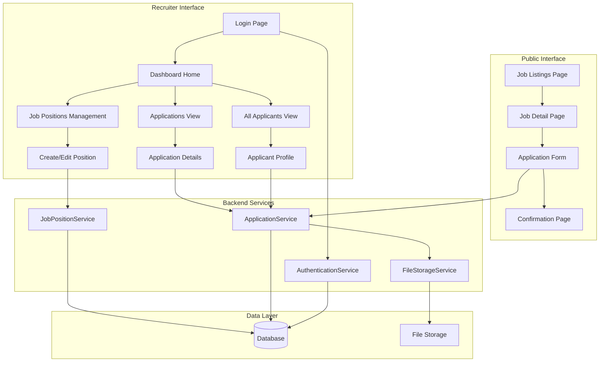
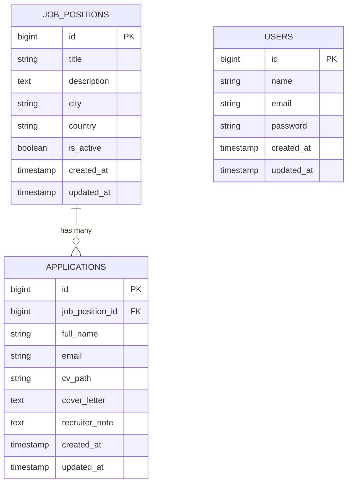

# Design Document

## Overview

The Recruiter Dashboard is a Laravel-based web application with two distinct interfaces: a public job portal for applicants and a private dashboard for recruiters. The application uses Laravel 12 with PHP 8.4, leveraging Eloquent ORM for database operations and Inertia.js with Vue.js for a modern, reactive frontend experience.

### Architecture Pattern

The application follows the MVC (Model-View-Controller) pattern enhanced with Laravel's service layer pattern for complex business logic. Authentication is handled through Laravel's built-in authentication system with middleware-based route protection.

### Technology Stack

- **Backend**: Laravel 12 (PHP 8.4)
- **Frontend**: Vue.js 3 with Inertia.js
- **Database**: MySQL or PostgreSQL
- **File Storage**: Laravel's filesystem abstraction (local/S3-compatible)
- **Authentication**: Laravel Breeze/Sanctum

## Architecture

### System Architecture Diagram



### Application Structure

```
app/
├── Http/
│   ├── Controllers/
│   │   ├── Public/
│   │   │   ├── JobPositionController.php
│   │   │   └── ApplicationController.php
│   │   └── Admin/
│   │       ├── DashboardController.php
│   │       ├── JobPositionController.php
│   │       ├── ApplicationController.php
│   │       └── ApplicantController.php
│   ├── Middleware/
│   │   └── EnsureUserIsRecruiter.php
│   └── Requests/
│       ├── StoreJobPositionRequest.php
│       ├── UpdateJobPositionRequest.php
│       └── StoreApplicationRequest.php
├── Models/
│   ├── User.php
│   ├── JobPosition.php
│   ├── Application.php
│   └── Applicant.php
├── Services/
│   ├── JobPositionService.php
│   ├── ApplicationService.php
│   └── FileStorageService.php
└── Policies/
    ├── JobPositionPolicy.php
    └── ApplicationPolicy.php

resources/
└── js/
    ├── Pages/
    │   ├── Public/
    │   │   ├── Jobs/
    │   │   │   ├── Index.vue
    │   │   │   ├── Show.vue
    │   │   │   └── Apply.vue
    │   │   └── ApplicationConfirmation.vue
    │   └── Admin/
    │       ├── Dashboard.vue
    │       ├── JobPositions/
    │       │   ├── Index.vue
    │       │   ├── Create.vue
    │       │   └── Edit.vue
    │       ├── Applications/
    │       │   ├── Index.vue
    │       │   └── Show.vue
    │       └── Applicants/
    │           ├── Index.vue
    │           └── Show.vue
    └── Components/
        ├── ApplicationCard.vue
        ├── JobPositionCard.vue
        └── FileUpload.vue
```

## Components and Interfaces

### Database Models

#### JobPosition Model

```php
class JobPosition extends Model
{
    protected $fillable = [
        'title',
        'description',
        'city',
        'country',
        'is_active'
    ];

    protected $casts = [
        'is_active' => 'boolean',
        'created_at' => 'datetime',
        'updated_at' => 'datetime'
    ];

    public function applications(): HasMany
    {
        return $this->hasMany(Application::class);
    }

    public function scopeActive($query)
    {
        return $query->where('is_active', true);
    }
}
```

#### Application Model

```php
class Application extends Model
{
    protected $fillable = [
        'job_position_id',
        'full_name',
        'email',
        'cv_path',
        'cover_letter',
        'recruiter_note'
    ];

    protected $casts = [
        'created_at' => 'datetime',
        'updated_at' => 'datetime'
    ];

    public function jobPosition(): BelongsTo
    {
        return $this->belongsTo(JobPosition::class);
    }

    public function getCvUrlAttribute(): string
    {
        return Storage::url($this->cv_path);
    }
}
```

#### User Model (Recruiter)

```php
class User extends Authenticatable
{
    protected $fillable = [
        'name',
        'email',
        'password',
    ];

    protected $hidden = [
        'password',
        'remember_token',
    ];

    protected $casts = [
        'email_verified_at' => 'datetime',
        'password' => 'hashed',
    ];
}
```

### Service Layer

#### ApplicationService

Handles business logic for application management:

```php
class ApplicationService
{
    public function __construct(
        private FileStorageService $fileStorage
    ) {}

    public function createApplication(array $data, UploadedFile $cv): Application
    {
        // Store CV file
        $cvPath = $this->fileStorage->storeCv($cv, $data['full_name']);
        
        // Create application
        return Application::create([
            'job_position_id' => $data['job_position_id'],
            'full_name' => $data['full_name'],
            'email' => $data['email'],
            'cv_path' => $cvPath,
            'cover_letter' => $data['cover_letter'] ?? null,
        ]);
    }

    public function getAllApplicants(): Collection
    {
        return Application::select('full_name', 'email')
            ->distinct()
            ->get()
            ->map(function ($app) {
                return [
                    'full_name' => $app->full_name,
                    'email' => $app->email,
                    'applications_count' => Application::where('email', $app->email)->count()
                ];
            });
    }

    public function getApplicantApplications(string $email): Collection
    {
        return Application::with('jobPosition')
            ->where('email', $email)
            ->orderBy('created_at', 'desc')
            ->get();
    }

    public function downloadAllCvs(?int $jobPositionId = null): string
    {
        return $this->fileStorage->createCvArchive($jobPositionId);
    }

    public function updateRecruiterNote(Application $application, string $note): Application
    {
        $application->update(['recruiter_note' => $note]);
        return $application->fresh();
    }
}
```

#### FileStorageService

Manages file uploads and downloads:

```php
class FileStorageService
{
    private const CV_STORAGE_PATH = 'cvs';
    private const MAX_FILE_SIZE = 5 * 1024 * 1024; // 5MB

    public function storeCv(UploadedFile $file, string $applicantName): string
    {
        $filename = $this->generateCvFilename($file, $applicantName);
        return $file->storeAs(self::CV_STORAGE_PATH, $filename, 'private');
    }

    public function createCvArchive(?int $jobPositionId = null): string
    {
        $applications = $jobPositionId
            ? Application::where('job_position_id', $jobPositionId)->get()
            : Application::all();

        $zip = new ZipArchive();
        $zipFilename = 'cvs_' . now()->format('Y-m-d_His') . '.zip';
        $zipPath = storage_path('app/temp/' . $zipFilename);

        $zip->open($zipPath, ZipArchive::CREATE);

        foreach ($applications as $application) {
            $cvPath = storage_path('app/private/' . $application->cv_path);
            $archiveName = $this->generateArchiveFilename($application);
            $zip->addFile($cvPath, $archiveName);
        }

        $zip->close();
        return $zipPath;
    }

    private function generateCvFilename(UploadedFile $file, string $applicantName): string
    {
        $sanitizedName = Str::slug($applicantName);
        $extension = $file->getClientOriginalExtension();
        $timestamp = now()->timestamp;
        return "{$sanitizedName}_{$timestamp}.{$extension}";
    }

    private function generateArchiveFilename(Application $application): string
    {
        $name = Str::slug($application->full_name);
        $position = Str::slug($application->jobPosition->title);
        $extension = pathinfo($application->cv_path, PATHINFO_EXTENSION);
        return "{$name}_{$position}.{$extension}";
    }
}
```

### API Endpoints / Routes

#### Public Routes

```php
// Public job portal routes
Route::prefix('jobs')->name('jobs.')->group(function () {
    Route::get('/', [Public\JobPositionController::class, 'index'])->name('index');
    Route::get('/{jobPosition}', [Public\JobPositionController::class, 'show'])->name('show');
    Route::post('/{jobPosition}/apply', [Public\ApplicationController::class, 'store'])->name('apply');
    Route::get('/application/confirmation', [Public\ApplicationController::class, 'confirmation'])->name('confirmation');
});
```

#### Admin Routes (Protected)

```php
// Admin routes - require authentication
Route::prefix('admin')->name('admin.')->middleware(['auth'])->group(function () {
    Route::get('/dashboard', [Admin\DashboardController::class, 'index'])->name('dashboard');
    
    // Job positions management
    Route::resource('job-positions', Admin\JobPositionController::class);
    
    // Applications management
    Route::prefix('applications')->name('applications.')->group(function () {
        Route::get('/', [Admin\ApplicationController::class, 'index'])->name('index');
        Route::get('/{application}', [Admin\ApplicationController::class, 'show'])->name('show');
        Route::patch('/{application}/note', [Admin\ApplicationController::class, 'updateNote'])->name('update-note');
        Route::get('/download-cvs', [Admin\ApplicationController::class, 'downloadAllCvs'])->name('download-all-cvs');
        Route::get('/job-position/{jobPosition}/download-cvs', [Admin\ApplicationController::class, 'downloadJobCvs'])->name('download-job-cvs');
    });
    
    // Applicants view
    Route::prefix('applicants')->name('applicants.')->group(function () {
        Route::get('/', [Admin\ApplicantController::class, 'index'])->name('index');
        Route::get('/{email}', [Admin\ApplicantController::class, 'show'])->name('show');
    });
});
```

## Data Models

### Database Schema

```sql
-- Job Positions Table
CREATE TABLE job_positions (
    id BIGINT UNSIGNED AUTO_INCREMENT PRIMARY KEY,
    title VARCHAR(255) NOT NULL,
    description TEXT NOT NULL,
    city VARCHAR(100) NOT NULL,
    country VARCHAR(100) NOT NULL,
    is_active BOOLEAN DEFAULT TRUE,
    created_at TIMESTAMP NULL,
    updated_at TIMESTAMP NULL,
    INDEX idx_is_active (is_active),
    INDEX idx_created_at (created_at)
);

-- Applications Table
CREATE TABLE applications (
    id BIGINT UNSIGNED AUTO_INCREMENT PRIMARY KEY,
    job_position_id BIGINT UNSIGNED NOT NULL,
    full_name VARCHAR(255) NOT NULL,
    email VARCHAR(255) NOT NULL,
    cv_path VARCHAR(500) NOT NULL,
    cover_letter TEXT NULL,
    recruiter_note TEXT NULL,
    created_at TIMESTAMP NULL,
    updated_at TIMESTAMP NULL,
    FOREIGN KEY (job_position_id) REFERENCES job_positions(id) ON DELETE CASCADE,
    INDEX idx_job_position_id (job_position_id),
    INDEX idx_email (email),
    INDEX idx_created_at (created_at)
);

-- Users Table (Recruiters)
CREATE TABLE users (
    id BIGINT UNSIGNED AUTO_INCREMENT PRIMARY KEY,
    name VARCHAR(255) NOT NULL,
    email VARCHAR(255) UNIQUE NOT NULL,
    email_verified_at TIMESTAMP NULL,
    password VARCHAR(255) NOT NULL,
    remember_token VARCHAR(100) NULL,
    created_at TIMESTAMP NULL,
    updated_at TIMESTAMP NULL
);
```

### Entity Relationship Diagram



## Error Handling

### Validation Rules

#### Job Position Validation

```php
class StoreJobPositionRequest extends FormRequest
{
    public function rules(): array
    {
        return [
            'title' => ['required', 'string', 'max:255'],
            'description' => ['required', 'string'],
            'city' => ['required', 'string', 'max:100'],
            'country' => ['required', 'string', 'max:100'],
        ];
    }

    public function messages(): array
    {
        return [
            'title.required' => 'Job title is required',
            'description.required' => 'Job description is required',
            'city.required' => 'City is required',
            'country.required' => 'Country is required',
        ];
    }
}
```

#### Application Validation

```php
class StoreApplicationRequest extends FormRequest
{
    public function rules(): array
    {
        return [
            'full_name' => ['required', 'string', 'min:2', 'max:255'],
            'email' => ['required', 'email', 'max:255'],
            'cv' => ['required', 'file', 'mimes:pdf,doc,docx', 'max:5120'], // 5MB
            'cover_letter' => ['nullable', 'string', 'max:5000'],
        ];
    }

    public function messages(): array
    {
        return [
            'full_name.required' => 'Full name is required',
            'full_name.min' => 'Full name must be at least 2 characters',
            'email.required' => 'Email is required',
            'email.email' => 'Please provide a valid email address',
            'cv.required' => 'CV file is required',
            'cv.mimes' => 'CV must be a PDF, DOC, or DOCX file',
            'cv.max' => 'CV file size must not exceed 5MB',
        ];
    }
}
```

### Exception Handling Strategy

1. **File Upload Errors**: Catch storage exceptions and return user-friendly messages
2. **Database Errors**: Log errors and show generic error messages to users
3. **Authentication Errors**: Redirect to login with appropriate flash messages
4. **Not Found Errors**: Return 404 pages for missing resources
5. **Validation Errors**: Display inline validation errors on forms

### Error Response Format

```php
// API-style error responses for AJAX requests
{
    "message": "The given data was invalid.",
    "errors": {
        "email": ["The email field is required."],
        "cv": ["The cv must be a file of type: pdf, doc, docx."]
    }
}
```

## Testing Strategy

### Unit Tests

- **Model Tests**: Test relationships, scopes, and accessors
- **Service Tests**: Test business logic in isolation with mocked dependencies
- **Validation Tests**: Test form request validation rules

### Feature Tests

- **Public Portal Tests**:
  - Test job listing display
  - Test application submission flow
  - Test file upload validation
  - Test confirmation page display

- **Admin Dashboard Tests**:
  - Test authentication requirements
  - Test job position CRUD operations
  - Test application viewing and filtering
  - Test recruiter note updates
  - Test CV download functionality
  - Test applicant listing and detail views

### Integration Tests

- **File Storage Tests**: Test actual file upload and retrieval
- **Database Tests**: Test complex queries and relationships
- **ZIP Archive Tests**: Test CV archive generation with multiple files

### Test Data Strategy

- Use Laravel factories for generating test data
- Use database transactions to rollback test data
- Store test files in a separate storage disk
- Mock external services when appropriate

### Example Test Structure

```php
class ApplicationSubmissionTest extends TestCase
{
    use RefreshDatabase;

    public function test_applicant_can_submit_application_with_valid_data()
    {
        $jobPosition = JobPosition::factory()->create();
        $cv = UploadedFile::fake()->create('cv.pdf', 1024);

        $response = $this->post(route('jobs.apply', $jobPosition), [
            'full_name' => 'John Doe',
            'email' => 'john@example.com',
            'cv' => $cv,
            'cover_letter' => 'I am interested in this position.',
        ]);

        $response->assertRedirect(route('jobs.confirmation'));
        $this->assertDatabaseHas('applications', [
            'job_position_id' => $jobPosition->id,
            'email' => 'john@example.com',
        ]);
    }

    public function test_application_requires_valid_cv_file()
    {
        $jobPosition = JobPosition::factory()->create();
        $invalidFile = UploadedFile::fake()->create('document.txt', 1024);

        $response = $this->post(route('jobs.apply', $jobPosition), [
            'full_name' => 'John Doe',
            'email' => 'john@example.com',
            'cv' => $invalidFile,
        ]);

        $response->assertSessionHasErrors('cv');
    }
}
```

## Security Considerations

1. **Authentication**: Use Laravel Breeze for recruiter authentication
2. **Authorization**: Implement policies to ensure only authenticated recruiters can access admin routes
3. **File Upload Security**: Validate file types, sizes, and store in private storage
4. **SQL Injection**: Use Eloquent ORM and parameter binding
5. **XSS Protection**: Vue.js automatically escapes output; use v-html sparingly
6. **CSRF Protection**: Laravel's CSRF middleware enabled for all POST/PUT/DELETE requests
7. **Rate Limiting**: Apply rate limiting to application submission endpoint
8. **File Access Control**: Serve CV files through authenticated controller actions, not direct URLs

## Performance Considerations

1. **Database Indexing**: Index foreign keys, email, and frequently queried fields
2. **Eager Loading**: Use `with()` to prevent N+1 queries when loading relationships
3. **Pagination**: Paginate large lists (applications, applicants)
4. **File Storage**: Use cloud storage (S3) for production scalability
5. **Caching**: Cache job position listings for public portal
6. **Queue Jobs**: Queue ZIP archive generation for large CV downloads
7. **Asset Optimization**: Use Vite for frontend asset bundling and optimization
